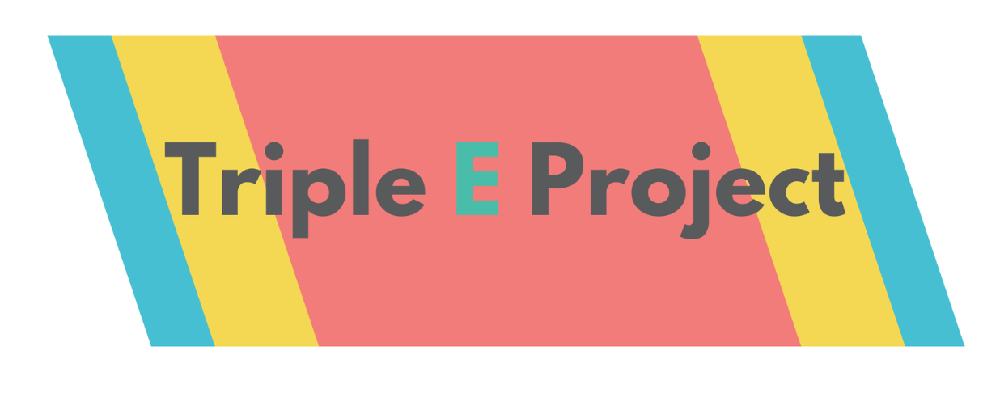

*Ongoing research. The details will be available soon*. However, my working notes can be found [here](https://amxlia.github.io/tripleEproject)

I am the lead analyst/biostatistician on the Triple E project. The published protocol can be viewed [here @ BMC Public Health](https://link.springer.com/article/10.1186/s12889-024-20124-5) 

The trial is registered at the Australian New Zealand Clinical Trials Registry (ACTRN12623000399695). Date registered: 19/04/2023.

