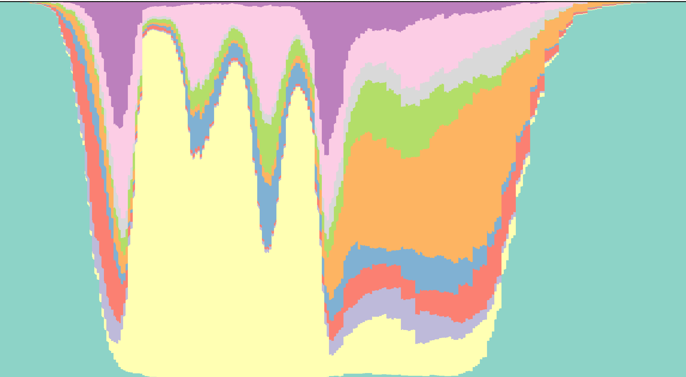

_to continue moving across from old notes_

## Introduction 
This analysis aims to identify distinct clusters of daily time use patterns and to examine how cluster membership is associated with depression and alcohol use, as well as their co-occurrence. 

Using data from the Longitudinal Study of Australian Children (Wave 8, B cohort, aged 14-15), I employed sequence analysis of daily time use diary data to identify homogenous clusters of adolescents with common time use patterns. 

Subsequently, I explored membership in these clusters and their associations with depression, alcohol use, and their co-occurrence to gain insight into how daily patterns may relate to the combined challenges of depression and alcohol related issues in adolescence (document to come)

All analyses are split by day type (school day vs non school day)

## Set-Up 
```{r}
#| label: setup-packages
#| results: hide
#| message: false
#|
# load packages
pacman::p_load(
  here,
  tidyverse,
  RColorBrewer,
  TraMineR,
  TraMineRextras,
  lubridate,
  cluster,
  WeightedCluster,
  haven,
  gtsummary,
  flextable,
  ggseqplot,
  ggpubr,
  patchwork,
  officer
)

# set wd
here::i_am("projects/sequenceandcluster/index.qmd")

# load data
data0 <- read.csv(here("R/tuddatab.csv"))
datalsac <- read.csv(here("R/lsacdatab.csv"))
act_dict <- readRDS(here("R/act_dict.RDS"))

# source custom flextable function
source(here("R/customflextable.R"))
```

## Data processing 
Filter for accurate diaries and flag school/non-school days. 
```{r}
# filter for accurate diaries
data1 <- data0 |>
  # group by individual
  group_by(hicid) |>
  # flag cases to keep
  mutate(
    keep_school = any(school == 1 & alarm1 == 2 & alarm2 == 2),
    keep_nonschool = any(
      (school == -9 | school == 2) & alarm1 == 2 & alarm2 == 2
    ),
    keep_any = keep_school | keep_nonschool
  ) |>
  ungroup() |>
  # filter the data
  filter(keep_any)

# create indicator that classifies diary as either a school or non-school day diary
id_daytype <- data1 |>
  group_by(hicid) |>
  summarise(
    day_type = case_when(
      any(school == 1) ~ "school",
      any(school %in% c(-9, 2)) ~ "nonschool",
      TRUE ~ NA_character_
    ),
    .groups = "drop"
  )
```

At this stage, we have 1321 valid diaries on school days and 1435 on non-school days. 

Convert episode start times and wake/sleep times and deal with the PM-to-AM transition after midnight as diaries run from 4am to 4am the following day. 

```{r}
# function for converting times 
convert_time <- function(time_vector) {
  time_vector <- parse_date_time(time_vector, "%I %M %p")
  transitions <- which(
    hour(time_vector[-1]) < 12 &
      hour(time_vector[-length(time_vector)]) >= 12
  )
  for (transition_row in transitions) {
    time_vector[(transition_row + 1):length(time_vector)] <-
      time_vector[(transition_row + 1):length(time_vector)] + days(1)
  }
  return(time_vector)
}

data2 <- data1 |>
  group_by(hicid) |>
  mutate(
    awaket = parse_date_time(awake, "%I:%M: %p"),
    sleept = parse_date_time(sleep, "%I:%M: %p"),
    stimet = convert_time(stime)
  ) |>
  ungroup()

data2$sleept <- if_else(
  format(data2$sleept, format = "%p") == "AM",
  data2$sleept + days(1),
  data2$sleept
)

```

Sleep episodes aren't captured as diariy entries. Incorporate wake and sleep times as explicit episodes force a fixed 4:00AM start and 4:00AM finish. 

```{r}
# select subset of data to use with sequence analysis
data3 <- data2 |>
  select(hicid, stimet, mainact) |>
  left_join(id_daytype, by = "hicid")

# incorporate sleeptimes into main activities vector
# add the first awake time and first sleep time per id when main act == 0 (sleep)
awake_times <- data2 |>
  group_by(hicid) |>
  summarise(
    stimet = first(awaket),
    mainact = 0,
    .groups = "drop"
  ) |>
  left_join(id_daytype, by = "hicid")

sleep_times <- data2 %>%
  group_by(hicid) %>%
  summarise(stimet = first(sleept), mainact = 0, .groups = "drop") %>%
  left_join(id_daytype, by = "hicid")

# bind the data
data4 <- bind_rows(data3, awake_times, sleep_times) |>
  arrange(hicid, stimet)

# add start and stop times (4am to 4am next day) for each id
start_time <- data2 %>%
  group_by(hicid) %>%
  summarise(
    stimet = parse_date_time("04:00 AM", "%I:%M: %p"),
    mainact = 0,
    .groups = "drop"
  ) %>%
  left_join(id_daytype, by = "hicid")

stop_times <- data2 %>%
  group_by(hicid) %>%
  summarise(
    stimet = parse_date_time("04:00 AM", "%I:%M: %p") + days(1),
    mainact = 0,
    .groups = "drop"
  ) %>%
  left_join(id_daytype, by = "hicid")

# bind to data
data5 <- bind_rows(data4, start_time, stop_times) |>
  arrange(hicid, stimet)
```

Compute durations of each activity 
```{r}
# filter out stop and start times that are the same for each id
# calculate the duration between start_time and stop_time 
data6 <- data5 %>%
  group_by(hicid) %>%
  mutate(stop_time = if_else(row_number() == n(), stimet, lead(stimet))) %>%
  ungroup() %>%
  group_by(hicid) %>%
  filter(stimet != stop_time) %>%
  ungroup() %>%
  mutate(duration = difftime(stop_time, stimet, units = "mins"))

```

Original activity codes were mapped to ten aggregate activity categories (in `act_dict`). The ten categories are: 

| Code | Category              |
|------|-----------------------|
| 1    | Sleep                 |
| 2    | Education             |
| 3    | Work (paid/unpaid)    |
| 4    | Personal care         |
| 5    | Eating and drinking   |
| 6    | Sedentary behaviour   |
| 7    | Physical activity     |
| 8    | Leisure               |
| 9    | Socialising           |
| 10   | Travel                |

```{r}
# recode the activities into a smaller number of grouped activities
data6$act_rec <- recode(data6$mainact, !!!act_dict)

# remove cases with NA codes for recoded activities
filtered_data6 <- data6 %>%
  group_by(hicid) %>%
  filter(!any(is.na(act_rec))) %>%
  ungroup()

# check that all cases sum to 1440 mins (24 hours)
sumtime <- filtered_data6 %>%
  group_by(hicid) %>%
  summarise(sumtime = sum(duration))

# remove cases with sum of the duration longer than 1440
filtered_data7 <- filtered_data6 %>%
  group_by(hicid) %>%
  filter(sum(duration) <= 1440) %>%
  ungroup()
# check that all cases sum to 1440 mins (24 hours)
sumtime <- filtered_data7 %>%
  group_by(hicid) %>%
  summarise(sumtime = sum(duration))
```

Final analytic sample n = 2641. n = 1270 on school days and n = 1371 on non school days 

## Sequence Construction 
```{r}
# create the sequence dataframe with one long vector of activities repeated by their duration (minutes)
sequences <- rep(
  as.numeric(filtered_data7$act_rec),
  as.numeric(filtered_data7$duration)
)

# reshape the matrix where each row = participant, column = minute (1440 columns)
seq <- matrix(
  sequences,
  nrow = length(sequences) / 1440,
  ncol = 1440,
  byrow = TRUE
)

# create variable names for each of the minutes
activities <- c()
for (i in 0:1439) {
  activities <- c(activities, paste("var", i, sep = ""))
}

# transform matrix to dataframe and label rows by participant id
# get the same ordering as the constructed rows
id_order <- filtered_data7 |>
  distinct(hicid) |>
  pull(hicid)
stopifnot(length(id_order) == nrow(seq))

# used created vars names to name the columns in the dataframe and hicid for row names
data <- as.data.frame(seq, row.names = id_order)
colnames(data) <- activities

# create vector of time labels
t_intervals_labels <- format(
  seq.POSIXt(
    as.POSIXct("2023-09-05 04:00:00"),
    as.POSIXct("2023-09-06 03:59:00"),
    by = "1 min"
  ),
  "%H:%M"
)

# define labels for each activity category
labels <- c(
  "Sleep",
  "Education",
  "Work (paid/unpaid)",
  "Personal care",
  "Eating and drinking",
  "Sedentary behaviour",
  "Physical activity",
  "Leisure",
  "Socialising",
  "Travel"
)
```

Join to survey data 
```{r}
# get the day from the main data set
day_week <- data2 %>%
  select(hicid, day, school, nosch) %>%
  group_by(hicid) %>%
  summarise(day = first(day), school = first(school), nosch = first(nosch))
# link data back to the ids in the sequence matrix
data_day <- data.frame(hicid = as.numeric(rownames(data)))
data_day <- left_join(data_day, day_week, by = "hicid")

# merge survey weights into the data
lsacweights <- data.frame(hicid = datalsac$hicid, hweights = datalsac$hweights)
data_day <- left_join(data_day, lsacweights, by = "hicid")

# create day type factor
data_day <- data_day |>
  mutate(
    day_rec = case_when(
      school == 1 ~ "School",
      school %in% c(-9, 2) ~ "Non-school",
      TRUE ~ NA_character_
    ),
    day_rec = factor(day_rec, levels = c("School", "Non-school"))
  )

# get ids for school and non-school days seperately
s_id <- data_day |> filter(day_rec == "School") |> pull(hicid)
n_id <- data_day |> filter(day_rec == "Non-school") |> pull(hicid)

# split the wide activity matrix by id; keep only activity columns for seqdef
s_data <- data[as.character(s_id), , drop = FALSE]
n_data <- data[as.character(n_id), , drop = FALSE]

# keep weights separately
s_w <- data_day |>
  filter(hicid %in% s_id) |>
  arrange(match(hicid, s_id)) |>
  pull(hweights)
n_w <- data_day |>
  filter(hicid %in% n_id) |>
  arrange(match(hicid, n_id)) |>
  pull(hweights)

stopifnot(nrow(s_data) == length(s_w))
stopifnot(nrow(n_data) == length(n_w))

# create sequence object for each group
# Make `activities` match the s_data columns
activities <- colnames(s_data)
stopifnot(length(activities) == ncol(s_data))
```

Create sequence objects
```{r}
# create sequence objects
seqs <- seqdef(
  s_data,
  var = activities,
  cnames = t_intervals_labels,
  alphabet = c("1", "2", "3", "4", "5", "6", "7", "8", "9", "10"),
  labels = labels,
  xtstep = 18,
  id = rownames(s_data)
)

seqn <- seqdef(
  n_data,
  var = activities,
  cnames = t_intervals_labels,
  alphabet = c("1", "2", "3", "4", "5", "6", "7", "8", "9", "10"),
  labels = labels,
  xtstep = 18,
  id = rownames(n_data)
)
```

Collapse into 5minute intervals for computation purposes and get substitution cost matrix based on observed transition rates 
```{r}
#| eval: false 
# collapse into 5-min intervals (from 1 minute intervals);
seqs5 <- seqgranularity(seqs, tspan = 5, method = "mostfreq")
seqn5 <- seqgranularity(seqn, tspan = 5, method = "mostfreq")

# compute substitution cost matrix based on observed transition rates;
scosts <- seqsubm(seqs5, method = "TRATE")
scostn <- seqsubm(seqn5, method = "TRATE")

# optimal matching; indel cost = 1,
om_times <- seqdist(seqs5, method = "OM", indel = 1, sm = scosts)
om_timen <- seqdist(seqn5, method = "OM", indel = 1, sm = scostn)
```

```{r}
#| echo: false
# sequence_objects <- list(
#     seqs5 = seqs5, 
#     seqn5 = seqn5, 
#     scosts = scosts, 
#     scostn = scostn, 
#     om_times = om_times, 
#     om_timen = om_timen
#     )
# saveRDS(sequence_objects, here("R/sequence_objects.RDS"))
sequence_objects <- readRDS(here("R/sequence_objects.RDS"))
```

## Descriptives of Sequences 
Across both day types, sleep made up the largest proportion of daily time, ranging from 6 – 10.5 hours. 
```{r}
# school days
statemeans <- as_tibble(
  round(seqmeant(seqs, serr = TRUE), 1),
  rownames = "State"
) |>
  mutate(State = labels) |>
  mutate(
    Sample = "s",
    Percent = round(Mean / 1440 * 100, 1),
    ifelse(grepl("\\.", Percent), Percent, paste0(Percent, ".0"))
  ) |>
  as.data.frame() |>
  select(State, Mean, Percent, SD = Stdev) |>
  mutate(
    Percent = paste0(Percent, "%"),
    Mean = ifelse(grepl("\\.", Mean), Mean, paste0(Mean, ".0")),
    SD = ifelse(grepl("\\.", SD), SD, paste0(SD, ".0")),
    Mean = paste0(Mean, " (", SD, ")")
  ) |>
  select(-SD) |>
  rename(`Mean minutes (SD)` = Mean, `% of Day` = Percent)

# non school days
statemeann <- as_tibble(
  round(seqmeant(seqn, serr = TRUE), 1),
  rownames = "State"
) |>
  mutate(State = labels) |>
  mutate(
    Sample = "Non-s",
    Percent = round(Mean / 1440 * 100, 1),
    ifelse(grepl("\\.", Percent), Percent, paste0(Percent, ".0"))
  ) |>
  as.data.frame() |>
  select(State, Mean, Percent, SD = Stdev) |>
  mutate(
    Percent = paste0(Percent, "%"),
    Mean = ifelse(grepl("\\.", Mean), Mean, paste0(Mean, ".0")),
    SD = ifelse(grepl("\\.", SD), SD, paste0(SD, ".0")),
    Mean = paste0(Mean, " (", SD, ")")
  ) |>
  select(-SD) |>
  rename(`Mean minutes (SD)` = Mean, `% of Day` = Percent)


# create overall descriptives table
descriptives <- statemeans |> left_join(statemeann, by = "State")
descriptives <- descriptives |>
  rename(
    minss = `Mean minutes (SD).x`,
    percs = `% of Day.x`,
    minsn = `Mean minutes (SD).y`,
    percn = `% of Day.y`,
  )

descriptives_tbl <- descriptives |> flextable()

typology <- data.frame(
  col_keys = names(descriptives_tbl$body$dataset),
  head = c("", rep("School days", 2), rep("Non-school days", 2)),
  head2 = c(
    "Activity",
    rep(c("Mean minutes (SD)", "% of Day"), 2)
  )
)
descriptives_tbl <- descriptives_tbl |>
  set_header_df(mapping = typology, key = "col_keys") |>
  merge_at(i = 1, j = c(2:3), part = "header") |>
  merge_at(i = 1, j = c(4:5), part = "header") |>
  align(align = "center", j = c(2:5), part = "all") |>
  my_flextable() |>
  hline(i = c(1, 2), part = "header", border = fp_border(color = "black")) %>%
  hline_top(border = fp_border(color = "black"), part = "all") |>
  hline_bottom(border = fp_border(color = "black"), part = "all")

descriptives_tbl
```

## Sequence Plots 
```{r}
# set colour palette for plots
colourCount = length(labels)
getPalette = colorRampPalette(brewer.pal(10, "Set3"))
colours <- getPalette(colourCount)
colours <- c("#8DD3C7", "#FFFFB3", "#BEBADA", "#FB8072", "#80B1D3", "#FDB462", "#B3DE69", "#D9D9D9", "#FCCDE5",  "#BC80BD")

cpal(seqs) <- colours
cpal(seqn) <- colours

# create labels
behaviour_labs <- c(
  "1" = "Sleep",
  "2" = "Education",
  "3" = "Work (paid/unpaid)",
  "4" = "Personal care",
  "5" = "Eating and drinking",
  "6" = "Sedentary behaviour",
  "7" = "Physical activity",
  "8" = "Leisure",
  "9" = "Socialising",
  "10" = "Travel"
)

plot_labs <- c(
  "Sleep",
  "Education",
  "Work",
  "Personal\ncare",
  "Eating and\ndrinking",
  "Sedentary\nbehaviour",
  "Physical\nactivity",
  "Leisure",
  "Socialising",
  "Travel"
)

common_theme <- theme(plot.margin = margin(8, 10, 12, 12))
```

### Transversal plots
Mean time plot displaying the average amount of time in each activity state
```{r}
#| label: fig-1
#| fig-cap: "Mean time plots on school and non-school days"
#| fig-width: 8
#| fig-height: 8
meantimeplot1 <- ggseqmtplot(seqs, weighted = TRUE) +
  scale_y_continuous(breaks = seq(0, 700, 50), limits = c(0, 700)) +
  labs(title = "School days", y = "Mean minutes per day") +
  scale_x_discrete(labels = plot_labs) +
  labs_pubr() +
  theme_pubclean() +
   theme(
    plot.title = element_text(size = 12, hjust = 0.5, face = "bold"),
    legend.position = "none",
    axis.title = element_text(size = 10, face = "bold"),
    axis.text = element_text(size = 9, face = "bold"),
    panel.border = element_rect(colour = "black", fill = NA, linewidth = 0.8)
  
   ) + common_theme
 
meantimeplot2 <- ggseqmtplot(seqn, weighted = TRUE) +
  scale_y_continuous(breaks = seq(0, 700, 50), limits = c(0, 700)) +
  labs(title = "Non-school days", y = "Mean minutes per day") +
 scale_x_discrete(labels = plot_labs) +
   labs_pubr() +
  theme_pubclean() +
   theme(
    plot.title = element_text(size = 12, hjust = 0.5, face = "bold"),
    legend.position = "none",
    axis.title = element_text(size = 10, face = "bold"),
    axis.text = element_text(size = 9, face = "bold"),
    panel.border = element_rect(colour = "black", fill = NA, linewidth = 0.8)
  
   ) + common_theme

meantimeplot <- wrap_elements(full = meantimeplot1) / wrap_elements(full = meantimeplot2)

meantimeplot
```

_to be continued_